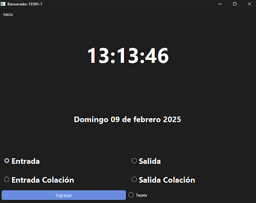
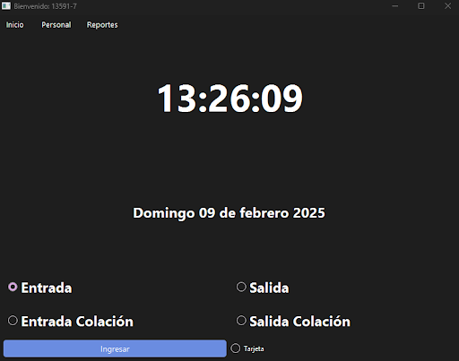

# Sistema de Reloj Control de Eduacional

Este sistema fue diseñado, modelado e implementado como proyecto de práctica profesional para la **Ilustre Municipalidad de Ovalle (2025)**. El objetivo principal de la solución es automatizar, asegurar y optimizar el proceso de registro de entrada y salida del personal de insituciones educativas a través de un flujo digital centralizado.

A diferencia de los scripts convencionales, este proyecto se abordó desde la perspectiva del ciclo de vida completo de la **Ingeniería de Software**, contando con una fase rigurosa de levantamiento de requerimientos, diseño arquitectónico UML y documentación técnica exhaustiva.

---

## Características Principales

* **Autenticación Dual Emulada:** Soporte para marcación de asistencia mediante contraseña segura de usuario o mediante la lectura automatizada con hardware de captura (lector de código de barras o lector de huellas digital).
* **Persistencia Relacional Robusta:** Arquitectura de datos estructurada en MySQL con integridad referencial completa para garantizar la trazabilidad de fechas, horas y jornadas laborales.
* **Control Extendible de Excepciones:** Bloques de control críticos para mitigar caídas de red o fallos de conexión con el servidor de base de datos, evitando la pérdida o duplicidad de registros.

---

## Stack Tecnológico

* **Lenguaje de Programación:** Python 3.x
* **Motor de Base de Datos:** MySQL
* **Modelado de Arquitectura:** Enterprise Architect / Lucidchart (UML 2.5)
* **Formato de Documentación:** Markdown & PDF

---

## Arquitectura y Diseño de Software

Para asegurar la escalabilidad y el mantenimiento del sistema a largo plazo, el desarrollo fue precedido por un modelado arquitectónico completo cuyas ilustraciones se encuentran disponibles en la carpeta `/diagrams`:

* **Modelo de Negocio:** *Diagrama de Casos de Uso* y *Diagrama de Actividades* para la definición del comportamiento del sistema y el flujo del usuario.
* **Diseño de Componentes:** *Diagrama de Clases* y *Diagramas de Secuencia* que detallan la interacción de los objetos en el backend de Python.
* **Modelo de Datos:** *Diagrama Entidad-Relación (DER)* detallando llaves primarias, foráneas y restricciones del esquema MySQL.

---

## Documentación de Ingeniería y Artefactos

El repositorio cuenta con el ciclo de documentación completo requerido en entornos corporativos de desarrollo. Los archivos PDF se encuentran listados en la carpeta `/docs`:

1. **[Especificación de Requerimientos de Software (SRS)](docs/especificacion_requerimientos.pdf):** Detalle de requisitos funcionales y no funcionales bajo lineamientos estándar.
2. **[Diccionario de Datos](docs/diccionario_datos.pdf):** Definición técnica de tablas, campos, tipos de datos y relaciones del modelo MySQL.
3. **[Manual del Desarrollador](docs/manual_desarrollador.pdf):** Documentación técnica interna que detalla la arquitectura del código, las clases implementadas y sus respectivas funciones.
4. **[Manual de Usuario](docs/manual_usuario.pdf):** Guía visual e instructivo operacional destinado al usuario final del sistema.

---

## Interfaz del Sistema (Capturas de Pantalla)

A continuación se presentan evidencias visuales del entorno gráfico del sistema extraídas directamente de la documentación oficial de usuario[cite: 1]:

### Pantalla de Marcación de Asistencia
*(Flujo principal interactivo para el personal municipal)*


### Panel de Administración de Usuarios
*(Módulo de gestión del personal y auditoría de horarios)*


---

## Estructura del Repositorio

```text
├── src/                      # Código fuente de la aplicación Python
│   ├── Control/              # Aquí se encuentran todos los controladores del sistema.
│   ├── Modelo/              # Aquí se encuentran todos los Modelos del sistema.
│   ├── Vista/              # Aquí se encuentran todos las Vistas del sistema.  
│   ├── app.py                # Punto de entrada de la aplicación
│   └── requeriments.txt      # Requerimientos de la instalación.
├── database/                 # Scripts de la base de datos
│   └── schema.sql            # Definición DDL del esquema relacional
├── diagrams/                 # Diagramas de arquitectura e imágenes de interfaz
│   ├── clases.png
│   ├── secuencia.png
│   └── pantalla_marcacion.png
├── docs/                     # Documentación formal del proyecto (PDFs)
│   ├── especificacion_requerimientos.pdf
│   ├── diccionario_datos.pdf
│   ├── manual_desarrollador.pdf
│   └── manual_usuario.pdf
├── .gitignore                # Exclusión de entornos virtuales y temporales
└── README.md                 # Documentación principal del proyecto
